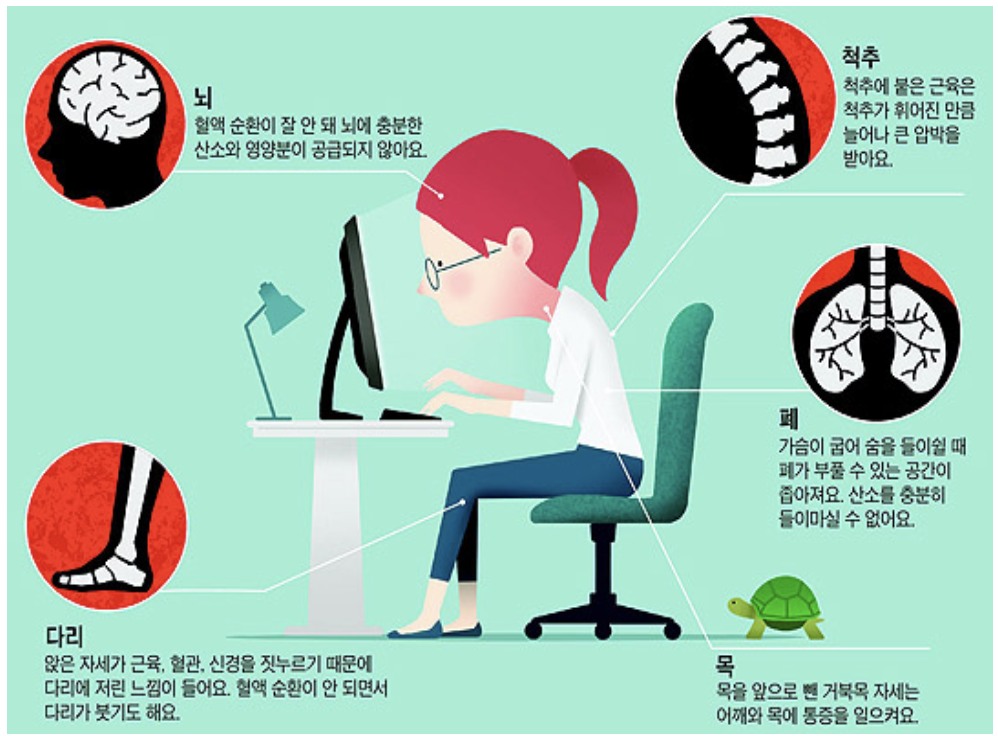
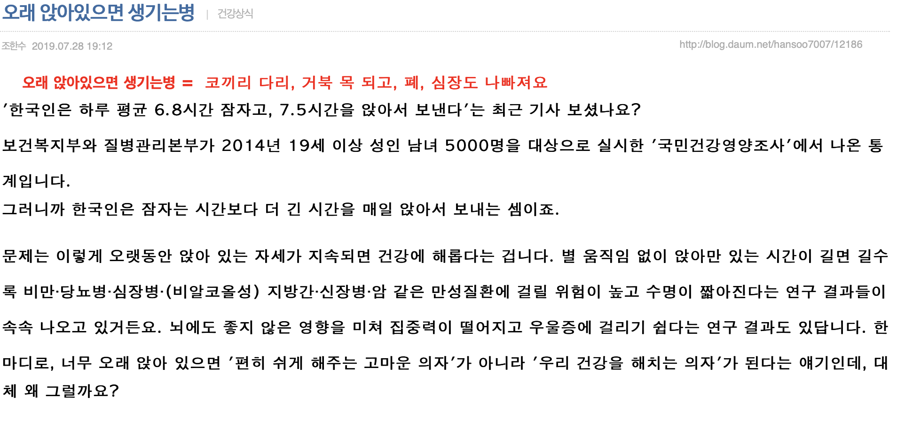
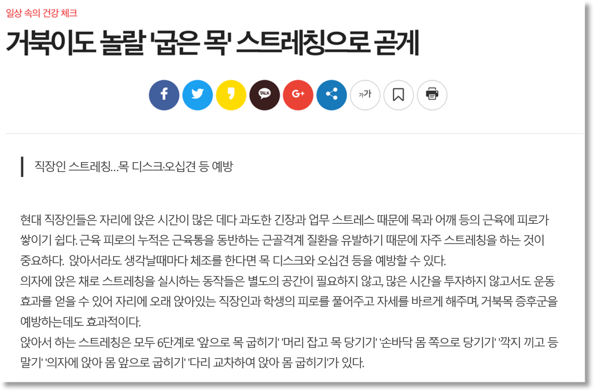
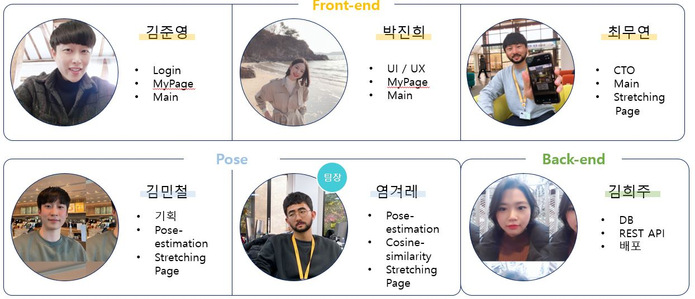
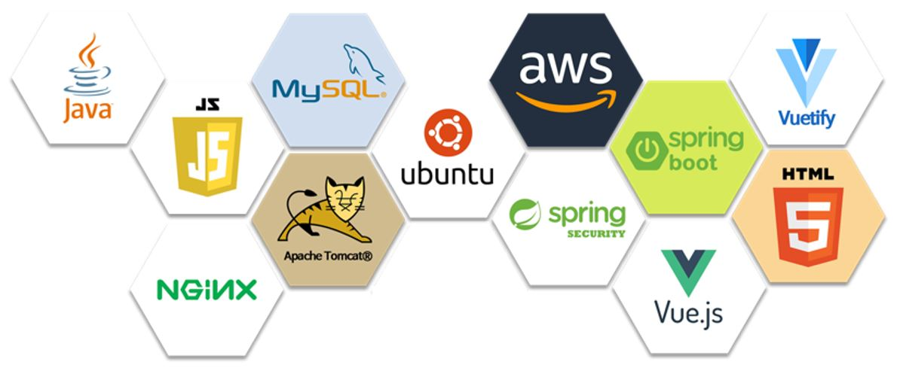
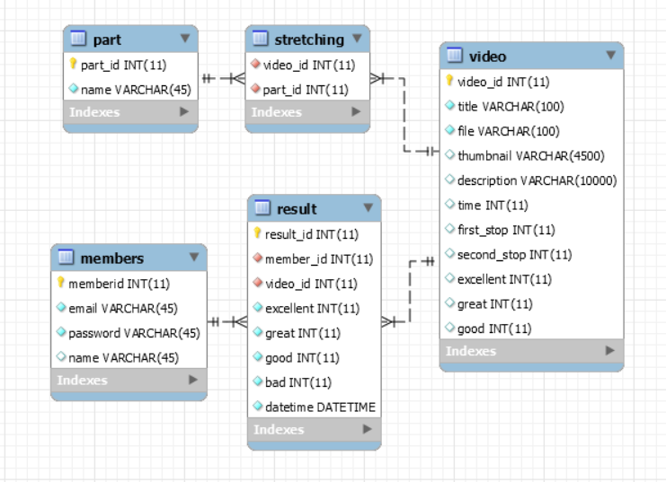
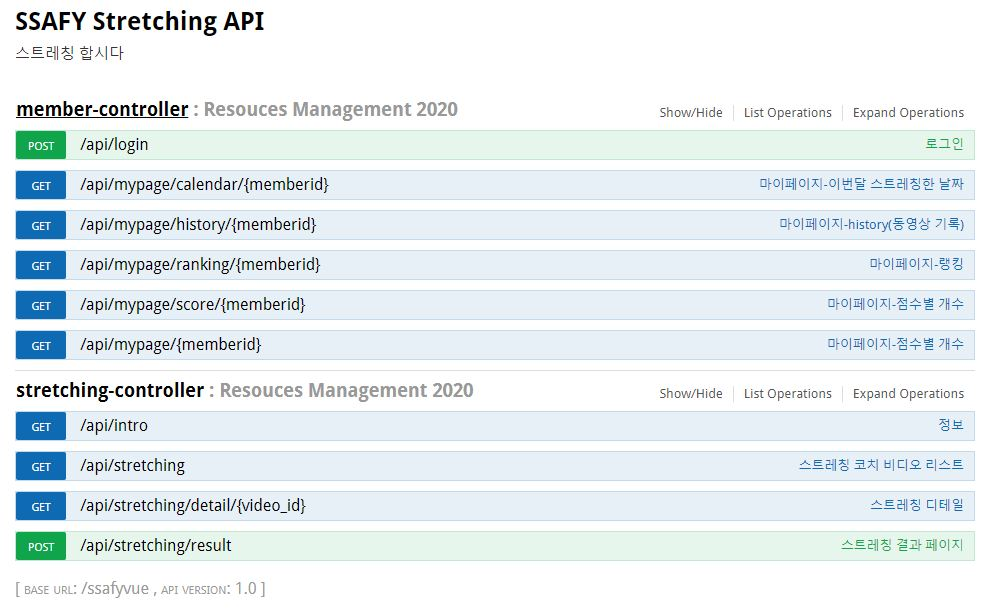

# Pose Estimation을 사용한 스트레칭 서비스

## 1. 프로젝트 개요

### 1) 프로젝트 대상

​	장시간 앉아 작업하는 모든 현대인들, 특히 싸피인들!

### 2) 필요성 




### 3) 기대효과



​	코로나19로 인해 재택근무가 늘어나면서 활동량은 줄어들고 컴퓨터 앞에 앉아 있는 시간이 늘어나고 있습니다. 최근 한의원에 손저림, 손목 통증, 목과 어깨의 통증을 호소하는 환자들이 방문이 증가하고 있습니다. 스트레칭만으로도 충분히 가벼운 외과질환을 예방할 수 있고 부위와 증상별로 정확한 스트레칭 방법을 알고 스트레칭을 해야 그 효과를 얻을 수 있으므로 이에 대한 정보를 영상으로 제공하고자 해당 서비스를 기획하였습니다.
[스트레칭 효과 6가지](https://brunch.co.kr/@tenbody/1146)

## 2. 역할

​	저희 팀은 프론트엔드 3명, 백엔드 1명, Pose estimation 모델 개발에 2명이 투입돼 개발을 진행했습니다. 역할 구분을 했지만 모든 팀원들이 모든 분야에서 협력하여 프로젝트를 진행했습니다.



## 3. 기술 스택

​	주로 프론트엔드에는 `Vue.js 기반의 프레임워크`들을 사용하였으며, 백엔드에서는 `Java Spring Boot`를 적극적으로 활용하였습니다. 그리고 `AWS 환경`에서 배포를 진행하였습니다.



## 4. Architecture


## 5. AI

### 1) Pose Estimation


​	computer vision에서 있어서 사람의 여러 부위의 위치(Position)와 방향 등을 탐지하는 문제입니다. 주로 사람의 신체 관절의 키포인트(Keypoint)가 어떻게 구성되어 있는지 위치를 추정(estimation)합니다..  주요 키포인트는 사람의 얼굴(눈, 코, 입, 귀 등), 어깨, 팔꿈치, 손목, 허리, 무릎, 발목 등으로 구성되어 있으며 pose estimation은 이 키포인트들을 판별할 수 있습니다.

> 참고자료
>
> [pytorch_Realtime_Multi-Person_Pose_Estimation](https://github.com/tensorboy/pytorch_Realtime_Multi-Person_Pose_Estimation)
>
> [[Pose Estimation] Human Pose Estimation 최신 연구 동향](https://eehoeskrap.tistory.com/329) 


### 2) Dataset

* [CoCo Dataset 2017 keypoints](http://cocodataset.org/#download)


### 3) 모델 훈련 에러사항

1. 기초 지식 부족
   
   * 단기간에 모델을 공부하여 구축하는것은 불가능했습니다. 1주간 참고자료를 보고 Pose-Estimation 구조를 파악하는것도 벅찼습니다.
2. 운영체제 차이
   
* 대부분 Linux 환경에서 개발하여 윈도우 환경에서 개발 할 시 환경에 맞는 Library 를 사용해야함
   
3. 노트북 VS 데스크탑

   * 느린 학습 속도 : 데스크탑은 GPU 4개를 사용하는 경우도 있어서 노트북과 성능 차이가 많이 났었습니다.

   * 아웃 오브 메모리 : 메모리 부족 현상으로 인해  학습속도가 더욱 저하 되었습니다.

   * 예시로 저희들이 직접 pose estimation 모델을 학습을 시도하였지만, 전체 학습에 대략 수일이 걸린다는 사실을 깨닫게 되었습니다. 아래는 모델 학습을 어느 정도 성공하였지만, 학습량이 부족해 정확한 Pose 추정을 할 수 없는 예시입니다.

     

3. 개발 환경 셋팅

   * 개발환경이 다 달라 Tensorflow , Cuda, 기타 라이브러리 버전 호환등을 체크하는것이 어려웠습니다.

   

### 4) API

* [Pose-net](https://github.com/PoseNet-Interaction/posenet-p5)


## 6. Backend

### 1) ERD



### 2) API 명세서



* POST `/api/login`

  > 회원 ID와 비밀번호를 입력 받아 로그인

  * Parameters

    ```JSON
    {
      "email": "string",	
      "password": "string"	
    }
    ```

  * Result

    ```JSON
    {
      "name": "test",
      "email": "test@naver.com",
      "memberid": 1
    }
    ```

* GET `/api/mypage/calendar/{memberid}`

  > 이번 달 스트레칭 한 날짜 표시

  - Result

    ```JSON
    {
      "stretching_date": [
        "2020-04-26",
        "2020-04-29",
        "2020-04-30"
      ]
    }
    ```

    

* GET `/api/mypage/history/{memberid}`

  > 최근 실행한 스트레칭 영상 목록

  - Result

    ```JSON
    {
      "history": [
        {
          "date": "2020-04-30 13:20:29",
          "thumbnail": "https://i02b104.p.ssafy.io/thumbnail/1935.png",
          "description": "팔을 반대 방향으로 뻗고, 반대편 팔을 걸어 안쪽으로 당긴다.",
          "title": "어깨스트레칭",
          "video_id": 2
        },
        ...
      ]
    }
    ```
    
    
  
* GET `/api/mypage/ranking/{memberid}` 

  > 스트레칭 실행 횟수 순위

  - Result

    ```JSON
    {
      "rank": 1,
      "total_users": 7
    }
    ```

    

* GET `/api/mypage/score/{memberid}`

  > 스트레칭 점수별 개수

  - Result

    ```JSON
    {
      "bad": 76,
      "excellent": 74,
      "great": 3,
      "good": 7
    }
    ```

    

* GET `/api/mypage/{memberid}`

  >마이페이지에 포함되는 모든 정보(calendar, history, ranking, score)

  - Result

    ```JSON
    {
      "score": {
        "bad": 76,
        "excellent": 74,
        "great": 3,
        "good": 7
      },
      "stretching_date": [
        "2020-04-26",
        "2020-04-29",
        "2020-04-30"
      ],
      "ranking": {
        "rank": 1,
        "total_users": 7
      },
      "history": [
        {
          "date": "2020-04-30 13:20:29",
          "thumbnail": "https://i02b104.p.ssafy.io/thumbnail/1935.png",
          "description": "팔을 반대 방향으로 뻗고, 반대편 팔을 걸어 안쪽으로 당긴다.",
          "title": "어깨스트레칭",
          "video_id": 2
        },
        {
          "date": "2020-04-30 13:19:11",
          "thumbnail": "https://i02b104.p.ssafy.io/thumbnail/1943.png",
          "description": "한쪽 팔을 위로 뻗어 반대편으로 늘려준다.",
          "title": "허리스트레칭",
          "video_id": 5
        },
        ...
      ]
    }
    ```

    

* GET `/api/intro`

  > 총 회원 수, 오늘 스트레칭한 회원 수, 총 스트레칭 시간

  - Result

    ```JSON
    {
      "total_cnt": 8,
      "total_users": 7,
      "total_time": 1413
    }
    ```

    

* GET `/api/stretching`

  > 스트레칭 목록

  - Result

    ```JSON
    [
      {
        "video_id": 1,
        "title": "허리비틀기",
        "file": "IMG_1902.mp4",
        "thumbnail": "https://i02b104.p.ssafy.io/thumbnail/1902.png",
        "description": "한쪽 팔은 뒤로, 한쪽 팔은 반대편 무릎 바깥쪽에서 안쪽으로 당기며 허리를 비틀어준다.",
        "part": [
          "허리"
        ],
        "time": 0
      },
      {
        "video_id": 2,
        "title": "어깨스트레칭",
        "file": "IMG_1935.mp4",
        "thumbnail": "https://i02b104.p.ssafy.io/thumbnail/1935.png",
        "description": "팔을 반대 방향으로 뻗고, 반대편 팔을 걸어 안쪽으로 당긴다.",
        "part": [
          "어깨"
        ],
        "time": 0
      },
      ...
    ]
    ```
    
    
  
* GET `/api/stretching/detail/{video_id}`

  > 스트레칭 실행을 위한 영상별 상세 정보

  - Result

    ```JSON
    {
      "next": "/detail/2",
      "file": "IMG_1902.mp4",
      "excellent": 92,
      "description": "한쪽 팔은 뒤로, 한쪽 팔은 반대편 무릎 바깥쪽에서 안쪽으로 당기며 허리를 비틀어준다.",
      "time": 29,
      "first_stop": 5,
      "title": "허리비틀기",
      "great": 90,
      "good": 88,
      "video_id": 1,
      "second_stop": 20
    }
    ```

    

* POST `/api/stretching/result`

  > 스트레칭 결과 저장

  - Parameter

    ```JSON
    {
      "bad": 1,
      "excellent": 8,
      "good": 0,
      "great": 1,
      "member_id": 1,
      "video_id": 3
    }
    ```

## 7. Frontend

### 1) Component

* File Tree

  ```
  │  App.vue
  │      
  ├─components
  │  │  Calendar.vue         // Attendance Calendar in MY PAGE
  │  │  Chart.vue            // Chart Calendar in MY PAGE
  │  │  Header.vue         // Header
  │  │  History.vue         // Stretching History in MY PAGE
  │  │  LoginForm.vue         // Form in LOGIN PAGE
  │  │  Rangking.vue         // Ranking in MY PAGE
  │  │  Video.vue            // A Video in Video List
  │  │  VideoList.vue         // Video List in STRECTCHING LIST PAGE
  │  │  
  │  ├─introItems            // INDEX PAGE Component
  │  │      Effect.vue      // Stretching Effect link in Navigation bar
  │  │      Explanation.vue   // Explanation link in Navigation bar
  │  │      Recommendation.vue// Recommendation link in Navigation bar
  │  │      Statistic.vue      // Statistic link in Navigation bar
  │  │      
  │  ├─items
  │  │      HelpCard.vue      // Helpcard 
  │  │      HelpIcon.vue      // Helpcard Button
  │          
  └─views
          IntroPage.vue      // INDEX PAGE
          LoginPage.vue      // LOGIN PAGE
          MainPage.vue      // STRECTCHING LIST PAGE
          ResultPage.vue      // STRECTCHING RESULT PAGE
          StretchingPage.vue   // STRECTCHING PAGE
          UserInfoPage.vue   // MY PAGE
  ```


### 2) Reference

* [Vuejs](https://vuejs.org/)
* [Vuetify](https://vuetifyjs.com/ko/getting-started/quick-start/)
* [Vuex](https://vuex.vuejs.org/kr/)
* [Animate.css](https://daneden.github.io/animate.css/)
* [Fontawesome](https://fontawesome.com/)
* [Google Fonts](https://fonts.google.com/)