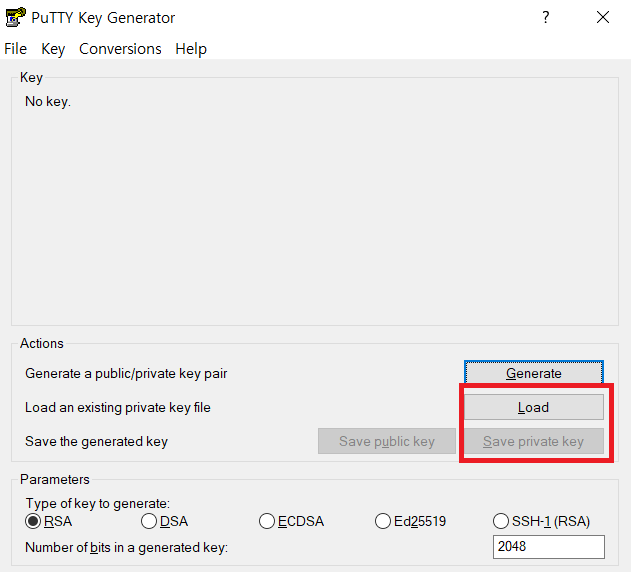
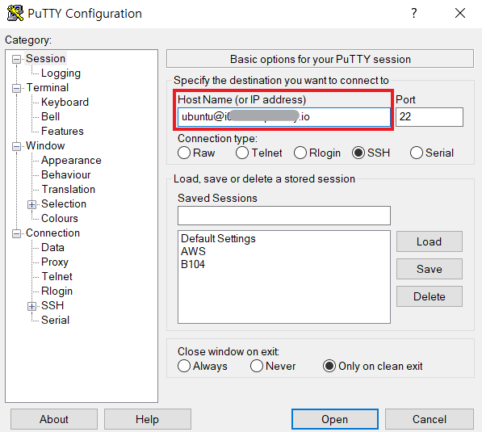
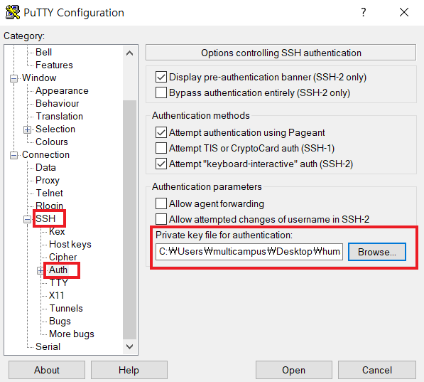

# backend

### 1. AWS 배포

#### 1-1. putty 접속

1. .pem > .ppk 변환

   - PuTTYgen

     

   - Load -> pem 선택 -> Save private key

2. PuTTy로 접속

   1. Host Name(or IP address) 작성

      

   2. SSH 설정

      


#### 1-2. Vue 배포

1. npm 설치

   ```
   $ sudo apt-get install npm
   ```

2. Vue, Vue cli 설치

   ```
   $ npm install -g vue
   $ npm install -g vue-cli
   ```

3. Vue 파일 전송(Windows -> ubuntu 파일 전송)

   - PuTTY가 있는 경로에서 pscp 사용

   ```
   pscp [업로드할파일경로] [서버접속계정]@[서버접속IP]:[서버디렉토리경로]
   ```

4. build

   ```
   $ npm install
   $ npm run build
   ```

5. `nginx` 설정

   1. nginx 설치

      ```
      $ sudo apt-get install nginx
      ```

   2. 설정파일 수정

      ```
      $ sudo vi /etc/nginx/sites-available/default
      ```

      ```
      server {
      	listen 80 default_server;
      	listen [::]:80 default_server;
      	
      	location / {
      		root [vue 경로]/dist;
      		index index.html;
      		try_files $uri $uri/ /index.html;
      	}
      }
      ```

   3. nginx 재시작

      ```
      $ systemctl stop nginx
      $ systemctl start nginx
      ```

6. https

